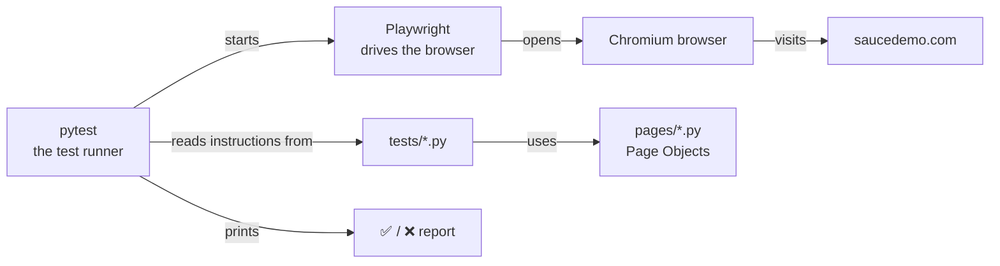
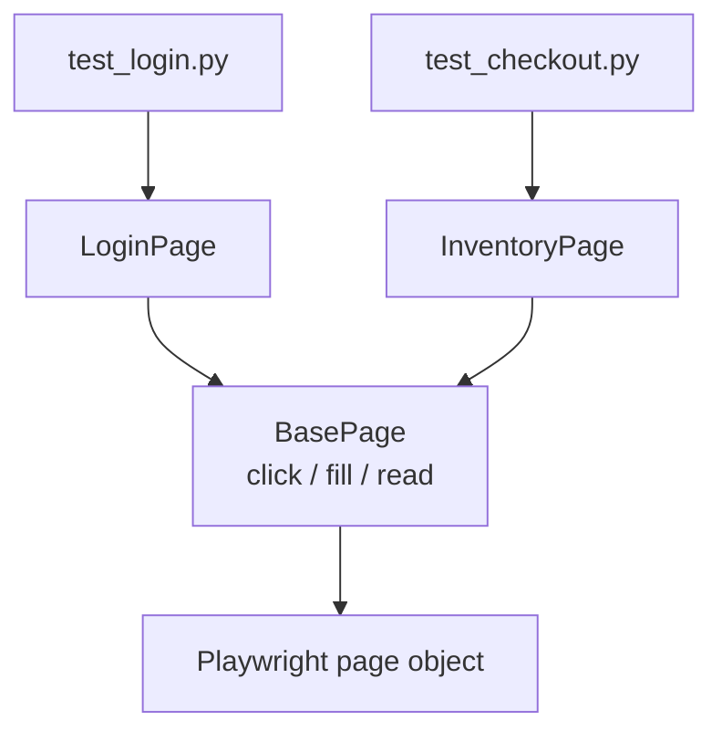
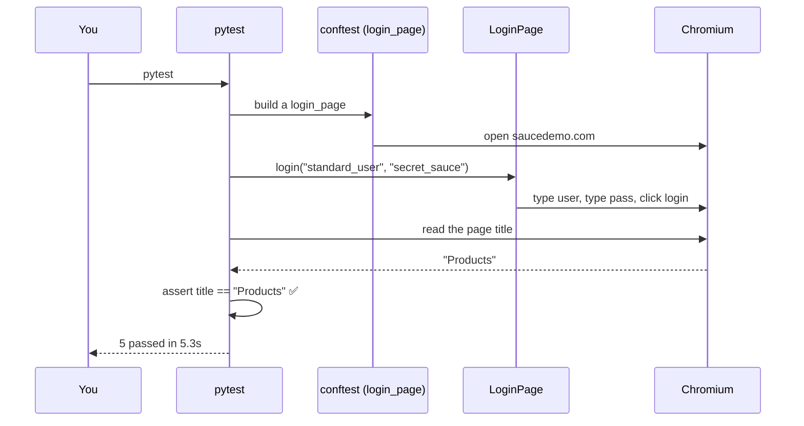

# LEARN.md — From Zero to Writing Tests in this Repo

> This guide assumes you have **never written code before**. Read it top to bottom.
> By the end you will understand what every file does and be able to add your own test.
>
> Project: **Web UI automation** — a robot that opens a browser, uses the
> [SauceDemo](https://www.saucedemo.com) shopping website like a human, and checks it behaves correctly.

---

## 0. The 60-second mental model

Imagine hiring a very fast, very literal intern whose only job is:

1. Open a web browser.
2. Type a username and password, click **Login**.
3. Check "did the right page appear?".
4. Report ✅ pass or ❌ fail.

That "intern" is code. This repo is a tidy way of writing instructions for that intern so the instructions are **reusable, readable, and reliable**. The tool that actually drives the browser is called **Playwright**. The tool that runs our checks and reports pass/fail is called **pytest**.



---

## 1. Set up your computer (one-time)

You need two things installed: **Python** (the language) and this project's **libraries**.

### 1a. Install Python
- **Mac:** Open the **Terminal** app (press `Cmd+Space`, type "Terminal"). Then check if Python exists:
  ```bash
  python3 --version
  ```
  If you see something like `Python 3.11.x`, you're good. If not, download it from [python.org/downloads](https://www.python.org/downloads/) and install.
- **Windows:** Install from [python.org/downloads](https://www.python.org/downloads/). **Important:** on the first install screen, tick **"Add Python to PATH"**. Then open **PowerShell** and run `python --version`.

> "Python" is just a program that reads files ending in `.py` and does what they say.

### 1b. Get this project onto your computer
`git` is a tool for downloading and tracking code. Install [Git](https://git-scm.com/downloads) if `git --version` fails. Then:
```bash
git clone https://github.com/selvamjstester/playwright-web-python.git
cd playwright-web-python
```
`git clone` = "download this project". `cd` = "change directory" = "go into that folder".

---

## 2. Terminal basics (the 6 commands you actually need)

The **terminal** (a.k.a. command line) is a text box where you type commands instead of clicking. That's it.

| Command | What it does | Example |
|---------|--------------|---------|
| `pwd` | **P**rint **w**orking **d**irectory — "where am I?" | `pwd` |
| `ls` | **L**i**s**t files in the current folder | `ls` |
| `cd foldername` | Go **into** a folder | `cd tests` |
| `cd ..` | Go **up** one folder | `cd ..` |
| `python3 -m venv .venv` | Create an isolated Python sandbox (explained below) | |
| `source .venv/bin/activate` | Turn the sandbox on (Mac/Linux) | |

On **Windows** the activate command is different: `.venv\Scripts\activate`.

---

## 3. The "virtual environment" (don't skip this)

A **virtual environment** (`venv`) is a private box of libraries just for this project, so projects don't fight over versions. Create and activate it, then install the libraries this project lists in `requirements.txt`:

```bash
python3 -m venv .venv           # create the box (do once)
source .venv/bin/activate       # step inside the box (Windows: .venv\Scripts\activate)
pip install -r requirements.txt # install this project's libraries
python -m playwright install chromium   # download the actual browser
```

- `pip` is Python's app store — it installs libraries.
- `requirements.txt` is a shopping list of libraries + exact versions.
- When the box is active, your prompt shows `(.venv)`. To leave it later, type `deactivate`.

---

## 4. A tiny Python primer (just enough to read this repo)

You do **not** need to master Python. You need to recognize 6 things:

```python
# 1) A variable — a labelled box holding a value
username = "standard_user"

# 2) A function — a named, reusable set of steps. "def" = define.
def login(user, password):
    page.fill("#user-name", user)   # indented lines belong to the function
    page.click("#login-button")

# 3) Calling a function — actually running it
login("standard_user", "secret_sauce")

# 4) A class — a bundle of related functions + data (a blueprint)
class LoginPage:
    def login(self, user, password):   # a function inside a class = "method"
        ...

# 5) An assert — the actual CHECK. If false, the test fails.
assert page.title() == "Swag Labs"

# 6) Indentation MATTERS in Python. Lines inside a block are indented 4 spaces.
```

That's genuinely enough to understand everything here. Two more terms:
- **`self`**: inside a class, `self` means "this specific object". Ignore the ceremony; it's how a method reaches the class's own data.
- **`#`** starts a **comment** — a note for humans that Python ignores.

---

## 5. Tour of every file in this repo

```
playwright-web-python/
├── requirements.txt   # the shopping list of libraries
├── pytest.ini         # settings for the test runner
├── config.py          # values that might change (URL, username...)
├── conftest.py        # shared setup ("fixtures") that tests reuse
├── pages/             # PAGE OBJECTS — one file per screen of the website
│   ├── base_page.py       # shared browser actions (click, fill, read text)
│   ├── login_page.py      # the login screen
│   └── inventory_page.py  # the products screen
└── tests/             # THE ACTUAL TESTS
    ├── test_login.py      # login scenarios
    └── test_checkout.py   # cart scenarios
```

### Why "Page Objects"? (the single most important idea here)
Instead of scattering `page.click("#login-button")` across 50 tests, we keep all the details of the login screen in **one** file: `pages/login_page.py`. Tests then just say `login_page.login(user, pass)`. If the website changes its login button, you fix **one line in one file**, not 50 tests. This pattern is called the **Page Object Model (POM)** and every serious UI test suite uses it.



### `config.py` — the settings
```12:19:config.py
class Config:
    """Central test configuration, overridable via environment variables."""

    BASE_URL = os.getenv("BASE_URL", "https://www.saucedemo.com")
    STANDARD_USER = os.getenv("STANDARD_USER", "standard_user")
```
`os.getenv("BASE_URL", "https://...")` means: "use the `BASE_URL` from the environment if it's set, otherwise fall back to saucedemo". This lets you point the same tests at a different website without editing code.

### `conftest.py` — fixtures (shared setup)
A **fixture** is prep-work a test needs before it runs. Here, `login_page` gives every test a ready-to-use login screen so tests don't repeat setup. pytest sees the name `login_page` in a test's arguments and automatically supplies it.

### `pages/base_page.py` — shared actions
Every page can `click`, `fill`, and read `text`. Rather than repeat those, they live once in `BasePage`, and `LoginPage`/`InventoryPage` **inherit** them (get them for free).

### `tests/test_login.py` — a real test, line by line
```8:14:tests/test_login.py
@pytest.mark.smoke
@pytest.mark.login
def test_valid_login_lands_on_inventory(login_page):
    login_page.login(Config.STANDARD_USER, Config.PASSWORD)
    inventory = InventoryPage(login_page.page)
    assert inventory.title() == "Products"
    assert inventory.item_count() == 6
```
- `@pytest.mark.smoke` is a **label** (a "marker"). It lets you run just the quick "smoke" tests later.
- Any function starting with `test_` is automatically discovered and run by pytest.
- The function does 3 things: **log in**, then **assert** the page title is "Products", then **assert** there are 6 items. If either check is wrong → ❌.

---

## 6. How a test actually runs (step by step)



---

## 7. Run the tests yourself

```bash
pytest                       # run everything
pytest -m smoke              # run only tests labelled "smoke"
pytest tests/test_login.py   # run just one file
pytest --headed              # WATCH the browser do it (great for learning!)
pytest -k "locked"           # run tests whose name contains "locked"
```

After a run, open `report.html` in your browser to see a nice report.

---

## 8. Now write your own test (guided exercise)

**Goal:** verify that a user with an empty username sees an error.

1. Open `tests/test_login.py`.
2. Add this new function at the bottom (keep the indentation exactly):

```python
@pytest.mark.login
def test_empty_username_shows_error(login_page):
    login_page.login("", "secret_sauce")     # log in with a blank username
    assert login_page.has_error()            # there should be an error
    assert "username is required" in login_page.error_message().lower()
```

3. Run just your test:
```bash
pytest -k "empty_username" --headed
```
4. Watch the browser, then see ✅ in the terminal. **You just wrote an automated test.**

> Notice you reused `login_page.login(...)`, `has_error()`, and `error_message()` — all already defined in `pages/login_page.py`. That's the payoff of Page Objects: writing new tests becomes easy sentences.

**Next challenge:** add a test in `tests/test_checkout.py` that adds the backpack to the cart, opens the cart, and asserts the cart still shows 1 item. All the building blocks already exist in `pages/inventory_page.py`.

---

## 9. How the robot runs in the cloud (CI)

`.github/workflows/ci.yml` tells **GitHub Actions** to automatically install everything and run all tests **every time code is pushed**. Green check = tests passed on a clean machine (not just "works on my laptop"). Look at the **Actions** tab on GitHub to see it.

---

## 10. Troubleshooting

| Symptom | Fix |
|---------|-----|
| `command not found: python3` | Python isn't installed / not on PATH. Re-install and tick "Add to PATH". |
| `No module named playwright` | You forgot `pip install -r requirements.txt` (with the venv active). |
| Browser doesn't open / driver error | Run `python -m playwright install chromium`. |
| `(.venv)` not showing | Run `source .venv/bin/activate` again. |
| Tests fail to reach the site | Check your internet; saucedemo.com must be reachable. |

---

## 11. Where to go next
- **Playwright (Python) docs:** https://playwright.dev/python/
- **pytest docs:** https://docs.pytest.org/
- **Python for absolute beginners:** https://www.python.org/about/gettingstarted/
- Read `pages/` first, then `tests/`. Change one thing, run it, see what happens. That loop is how you learn fastest.
```
